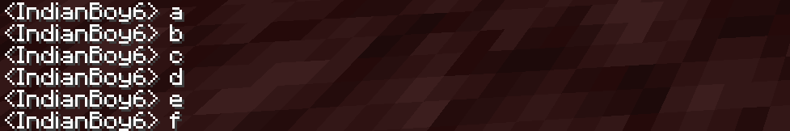
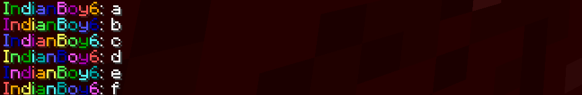

# Rainbow Chat

## What Is Rainbow Chat?
Rainbow chat is a [Spigot](https://spigotmc.org) plugin created to make the Minecraft chat more interesting. Usually, a player message will look like this: 

With Rainbow Chat, the same message looks like this:

 The colors are in rainbow order(ROYGBIV) but the starting point is randomized after every chat, so it many be OYGBIVR, or GBIVROY.

## Installation
Rainbow Chat uses Maven, so running `mvn package` will build the plugin into the target directory. After creating a 1.16.5 Spigot server, move the jar from target/ to the server's plugin folder. After this, no configuration is necessary to use Rainbow Chat.